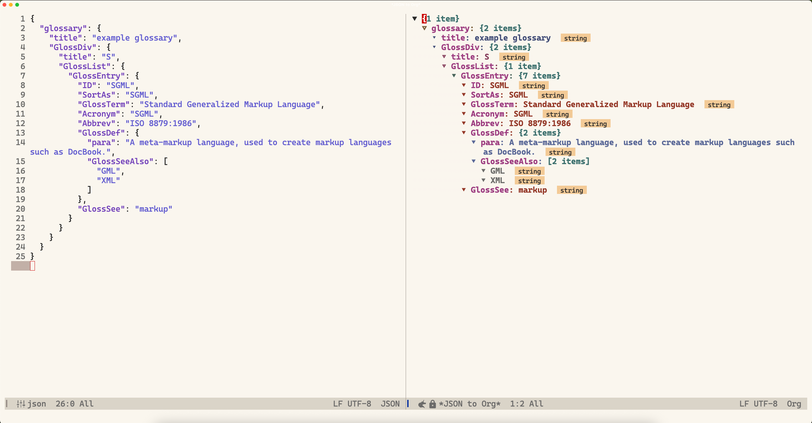

# orgml.el - JSON exploration in org-mode

An emacs JSON tree viewer you already mastered, inside org-mode.



## Why orgml.el?

Emacs has limited option for navigating and exploring JSON data. Existing solutions include `json-navigator`, which uses `hierarchy.el` for creating tree view. Orgml displays json data in org-mode format. This allows data exploration with the tools we are already familiar with, such as org visibility cycling, and sparse tree..

## Installation

### Manual Installation

1. Place `orgml.el` in your Emacs load path
2. Load the file: `(load-file "path/to/orgml.el")` or add to your init file

### Using use-package with :vc (Emacs 29+)

```elisp
(use-package orgml
  :vc (:url "https://github.com/maybetonyfu/orgml.git"
       :branch "main")
  :bind ("C-c j o" . orgml-new-buffer)) ;; An example keybinding
```

### Using straight.el

```elisp
(use-package orgml
  :straight (:host github 
             :repo "maybetonyfu/orgml"
             :branch "main")
  :bind ("C-c j o" . orgml-new-buffer)) ;; An example keybinding
```


## Usage
Run `M-x orgml-new-buffer`, (`C-c j o` or other keybinding you have customized) on an active region. The whole buffer will be used if no active region found. This will create a new read-only, displaying the JSON data in the familiar org-mode headline format.

### Example

Run `orgml-new-buffer on the json string below:
   ```json
   {
     "name": "John Doe",
     "age": 30,
     "skills": ["JavaScript", "Python", "Emacs Lisp"],
     "active": true,
     "aliases": [],
     "profile": null,
     "custom_data": {}
   }
   ```

This will generate an org buffer with the following content:
```org
* ~{5 items}~
** =name=: John Doe :string:
** =age=: 30 :number:
** =skills=: ~[3 items]~
*** JavaScript :string:
*** Python :string:
*** Emacs Lisp :string:
** =active=: true :bool:
** =aliases=: ~[empty]~
** =profile=: null :null:
** =profile=: ~{empty}~
```

## Conversion Rules

| JSON Type | Org Format                           | Example                                                           |
|-----------|--------------------------------------|-------------------------------------------------------------------|
| Number    | `* 42 :number:`                      | `42` → `* 42 :number:`                                            |
| String    | `* hello :string:`                   | `"hello"` → `* hello :string:`                                    |
| Boolean   | `* true :bool:`                      | `true` → `* t :bool:`                                             |
| Null      | `* null :null:`                      | `null` → `* null :null:`                                          |
| Array     | `* ~[N items]~` with sub-items       | `[1,2]` → `* ~[2 items]~`<br>`** 1 :number:`<br>`** 2 :number:`   |
| Object    | `* ~{N items}~` with key-value pairs | `{"key": "value"}` → `* ~{1 item}~`<br>`** =key=: value :string:` |

## License

This project is licensed under the GPL-3.0 License - see the [LICENSE](LICENSE) file for details.
